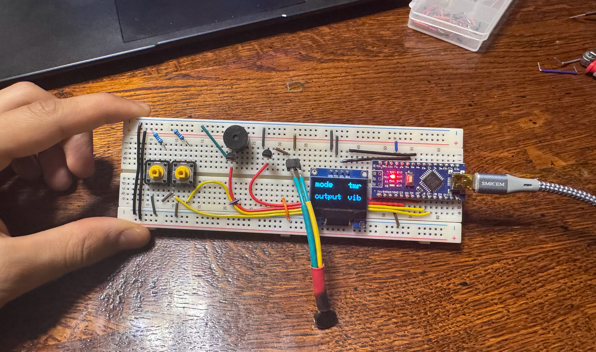

# multiTimer

 

My friend and I were at the track doing a 100 meter race, and we realized that to make the race fair, we needed another person to tell us when to go. If one of us did it, then it wouldn't be a fair test to both of our reaction times. So, I thought to build a handheld device that can do this for us by randomly beeping and telling us when to start. Additionally, a few times a week I do some prescribed physiotherapy excercises to help my knee pains. These involve 10 repititions of 10 second holds, and I thought that I could add a feature to this device to do all this counting for me. 

Taking all of this in, the objective of this project is:
- stopwatch that can be used to time sprints, randomly tells the user when to start
- timer that continuously counts down from 10 seconds for my physio excercises
- output types such as vibrate (haptic motor), beep (buzzer), or both
- handheld portable device, shaped to fit in the hand and still be durable

Video demonstration: 
https://photos.app.goo.gl/fJty5q4hyQ8Tirhj9

Rough Order of Events/Timeline:
- build on breadboard and test the buttons, display, and LEDs (used LEDs as output at first instead of buzzer and haptic motor)
- get the button tracking working (track button states, hold and idle time for both buttons)
- test the stopwatch and random start functionality
- format the menu on the display and allow for the user to switch between modes while on the menu
- make the stopwatch with its stop, random start, start, and reset functioanlity
- build on breadboard with haptic motor, buzzer, and transisters
- make the timer with its stop and start functioanlity
- combine all the code to get a working menu, stopwatch screen, timer screen, and the ability to switch between these
- add the output functioanlity to buzz or vibrate (or both)
- [in progress] build on soldered breadboard with ATmega328 chip
  

Last Updated: 
January 6th 2025 

Next Steps: 
- design the case and 3D print body

Possible improvements (not necessary but improve the device experience)
- design and print PCB to reduce size, ideally making the PCB long and narrow to allow for a baton-like shape
- use rechargeable battery (ie LiPo)
